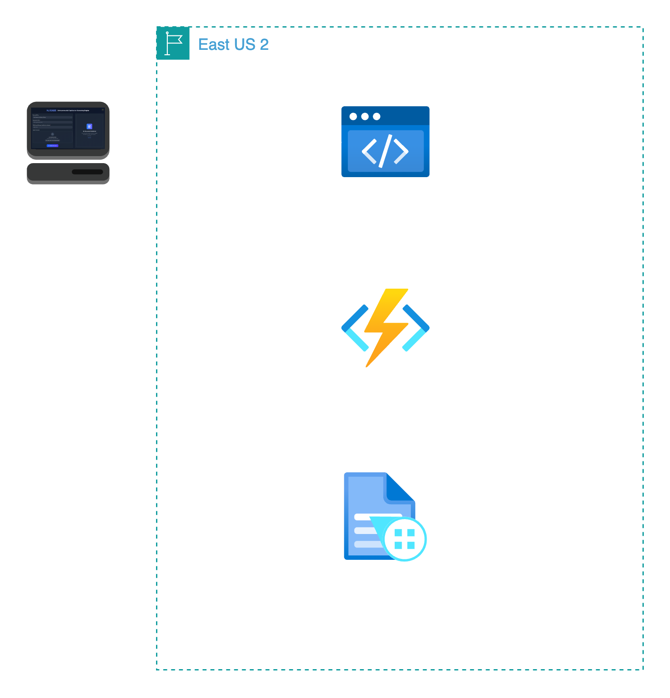

# 🏢 AI Document Validator

> _An intelligent document validation application that automatically validates business documents using Azure AI Form Recognizer and extracts key information for compliance verification._

---

## 🎬 Demo


> _Upload your business documents and get instant validation results with AI-powered analysis. Try the live demo at [your-deployed-url.vercel.app](https://your-deployed-url.vercel.app)_

---

## 🎯 What It Does

- 📋 **Multi-Document Validation**: Supports 11+ business document types  
  Validates Tax Clearance Certificates, Formation Documents, Operating Agreements, and more with intelligent field extraction.

- 🤖 **AI-Powered Analysis**: Azure Form Recognizer integration  
  Uses advanced OCR and machine learning to extract and validate document fields automatically.

- 🎨 **Modern UI/UX**: Drag-and-drop interface with real-time feedback  
  Dark/light theme support, responsive design, and intuitive document upload experience.

> Include visuals: Upload flow, validation results, and document type selection interface.

---

## 🏗️ Architecture



- Document validation workflow with Azure AI Form Recognizer integration
- Real-time processing with Next.js API routes and React components
- Example flow:

```
[Document Upload] → [File Validation] → [Azure AI Analysis] → [Field Extraction] → [Compliance Check] → [Results Display]
```

---

## 🛠️ Tech Stack

| Layer          | Tools & Frameworks                                      |
|----------------|---------------------------------------------------------|
| **Frontend**   | Next.js 15, React 19, Tailwind CSS, Lucide Icons       |
| **Backend**    | Next.js API Routes, Azure AI Form Recognizer            |
| **AI/ML**      | Azure AI Form Recognizer, Document Intelligence         |
| **DevOps**     | Vercel, GitHub Actions, ESLint                          |

---

## 🚀 Setup

```bash
# Clone the repo
git clone https://github.com/your-username/ai-document-validator.git
cd ai-document-validator

# Install dependencies
npm install

# Set up environment variables
cp .env.example .env.local

# Run locally
npm run dev
```

**Environment Variables (.env.local):**
```env
# Required: Azure AI Form Recognizer
NEXT_PUBLIC_AZURE_FORM_RECOGNIZER_ENDPOINT=your-azure-endpoint
NEXT_PUBLIC_AZURE_FORM_RECOGNIZER_KEY=your-azure-key

# Optional: Supabase for feedback feature
NEXT_PUBLIC_SUPABASE_URL=your-supabase-url
NEXT_PUBLIC_SUPABASE_ANON_KEY=your-supabase-key
```

---

## 📦 Core Modules

| Module                      | Description                                                                 |
|-----------------------------|-----------------------------------------------------------------------------|
| `DocumentValidator.jsx`     | Main validation orchestrator with state management and workflow control     |
| `FileUploadArea.jsx`        | Drag-and-drop file upload with validation and preview functionality        |
| `ValidationResults.jsx`     | AI analysis results display with extracted fields and compliance status    |
| `DocumentTypeSelector.jsx`  | Smart document type selection with dynamic field requirements               |
| `FormFields.jsx`            | Dynamic form generation based on document type requirements                 |

---

## 🔄 Document Processing Flow

> _Multi-step validation process with AI-powered analysis._

1. 📤 **Upload Agent** → Validates file type, size, and format compatibility  
2. 🔍 **Analysis Agent** → Extracts text and structure using Azure AI Form Recognizer  
3. ✅ **Validation Agent** → Compares extracted data against expected document fields  
4. 📊 **Results Agent** → Generates comprehensive validation report with confidence scores  
5. 💬 **Feedback Agent** → Enables user feedback collection for continuous improvement

---

## 🔒 Security & Privacy

- All documents processed in-memory, no permanent file storage
- Azure AI Form Recognizer handles data processing with enterprise-grade security
- Client-side file validation before upload
- Environment variables for secure API key management

---

## 🗺️ Roadmap

- [ ] Add support for custom document templates
- [ ] Implement batch document processing
- [ ] Add multi-language document support
- [ ] Enable document comparison and version tracking
- [ ] Add audit trail and compliance reporting
- [ ] Integrate with popular document management systems

---

## 🤝 Contributing

Pull requests are welcome! For major changes, please open an issue first to discuss proposed modifications.

1. Fork the repository
2. Create a feature branch (`git checkout -b feature/amazing-feature`)
3. Commit changes (`git commit -m 'Add amazing feature'`)
4. Push to branch (`git push origin feature/amazing-feature`)
5. Open a Pull Request

---

## 📄 License

MIT License – see `LICENSE.md` for details.

---

## 👥 Authors & Acknowledgements

- Built by Kaushik Manivannan & Aarushi Thejaswi
- Powered by Azure AI Form Recognizer  
- Inspired by the need for automated document compliance in business operations

---

## 📋 Supported Document Types

| Document Type | Required Fields | Use Case |
|---------------|----------------|----------|
| Tax Clearance Certificate (Online) | Organization Name, FEIN | Tax compliance verification |
| Tax Clearance Certificate (Manual) | Organization Name, FEIN | Legacy tax document validation |
| Certificate of Formation | Organization Name | Business entity formation |
| Certificate of Incorporation | Organization Name | Corporate structure validation |
| Operating Agreement | Organization Name | LLC governance documents |
| IRS Determination Letter | None | Non-profit status verification |
| Certificate of Authority | Organization Name | Foreign entity authorization |
| Certificate of Alternative Name | Organization Name | DBA registration documents |
| Certificate of Trade Name | Organization Name | Business name registration |
| By-laws | None | Corporate governance rules |

---

**File Support**: PDF, DOCX, DOC, TXT, PNG, JPG, JPEG (up to 50MB)  
**Processing Time**: ~2-5 seconds per document  
**Accuracy**: 95%+ field extraction accuracy with Azure AI